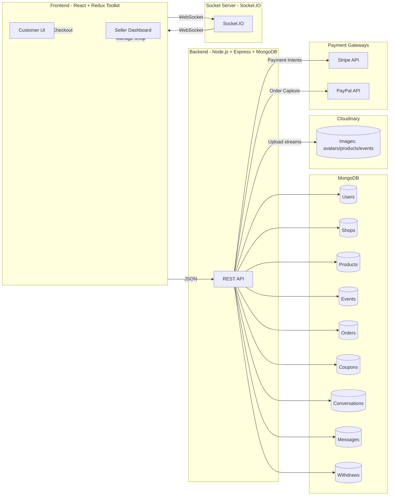
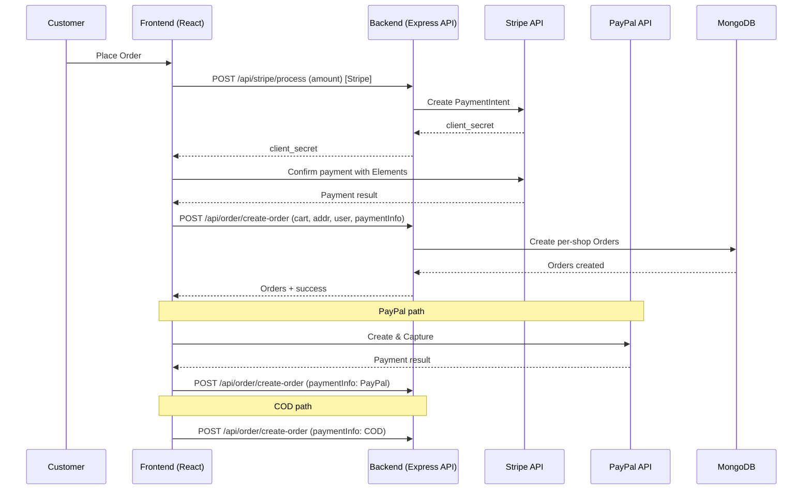
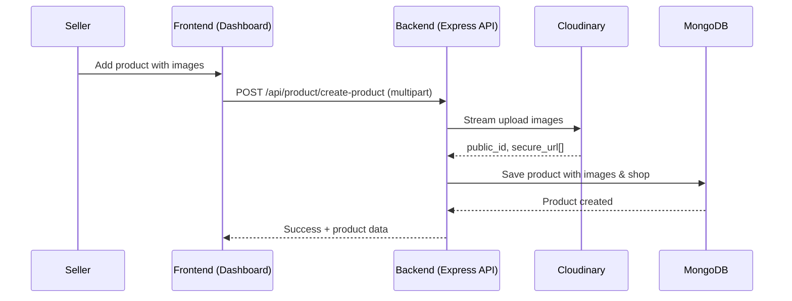
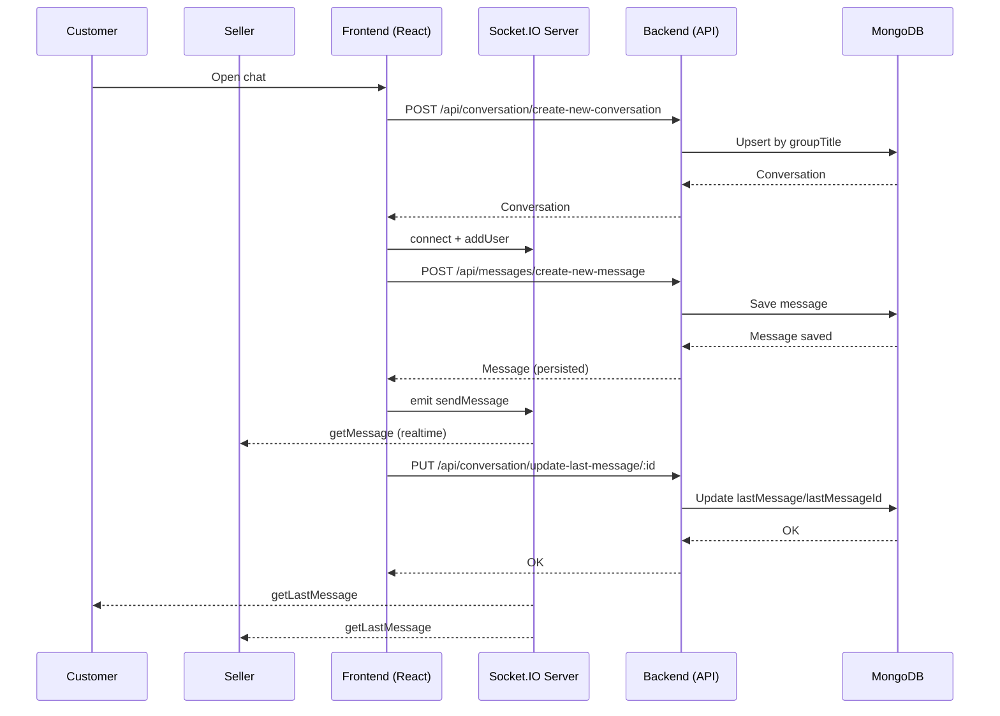
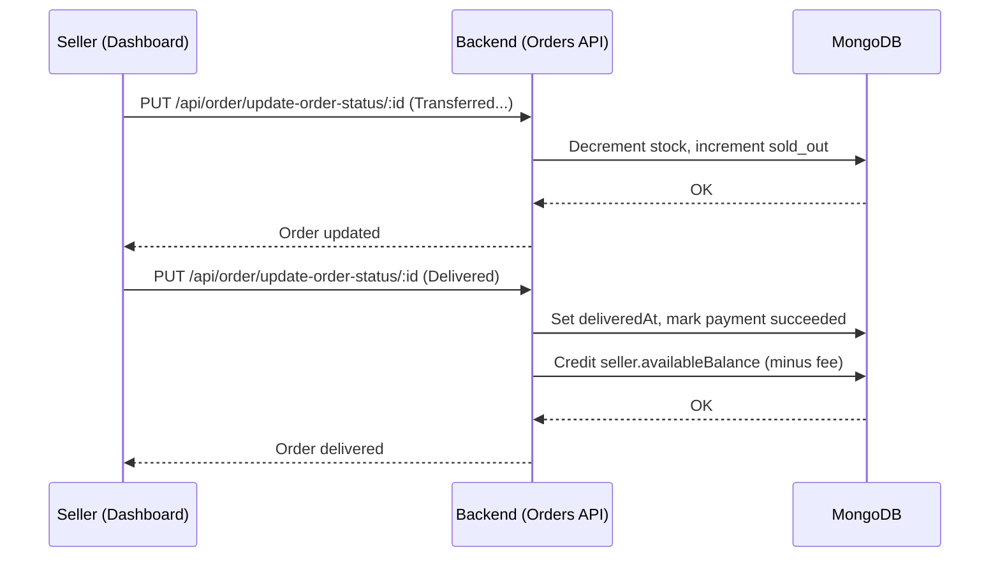
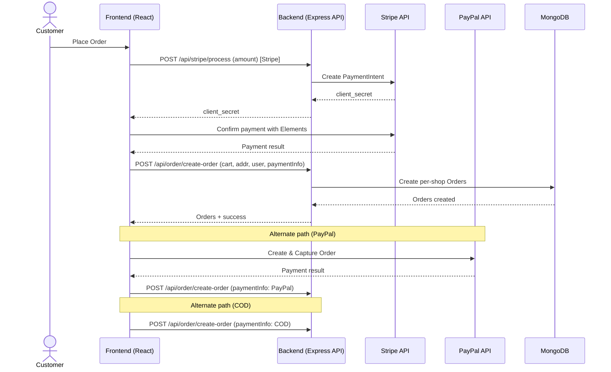
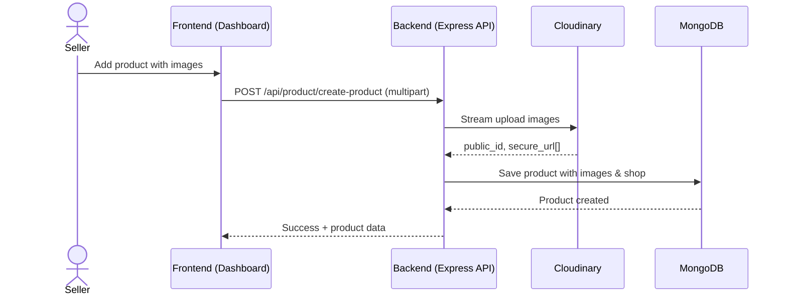
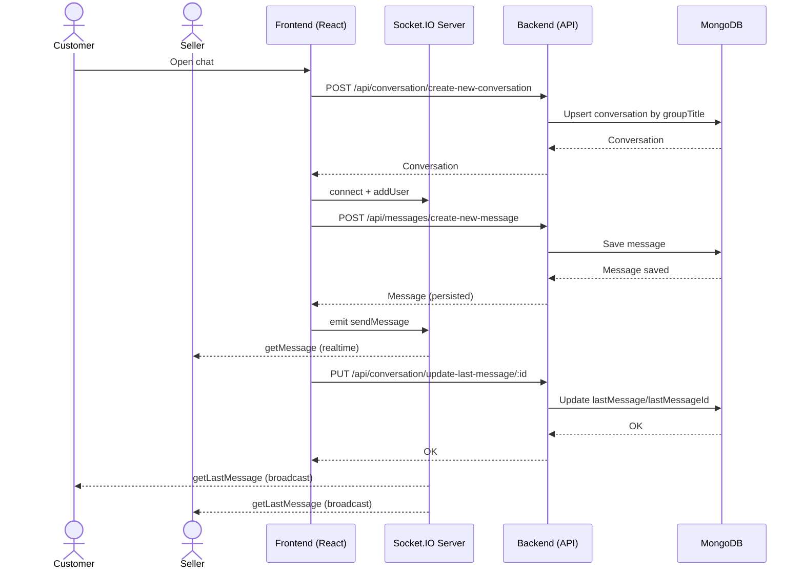

## Multivendor E‑Commerce Platform (MERN + Socket.IO)

### 1. Introduction
This multivendor e‑commerce platform enables multiple sellers to manage shops, publish products/events, fulfill orders and withdraw earnings. Customers can browse, checkout (Stripe/PayPal/COD), track orders, and chat with sellers in real time.

### 2. Problem Statement
Traditional single‑vendor stores limit catalog diversity and do not scale seller operations. A marketplace must provide:
- Dedicated seller spaces (catalog, orders, payouts)
- A seamless buyer journey (discovery → cart → payment → tracking)
- Realtime buyer–seller communication
- Transparent settlement and withdrawal flows for sellers

### 3. Objectives
- Support multi‑seller onboarding, activation, authentication, and shop settings
- Deliver a modern buyer experience with reviews, checkout, and tracking
- Integrate Stripe/PayPal/COD payment methods
- Implement robust order lifecycle and refund handling
- Provide realtime messaging and last‑message synchronization
- Manage seller balances and withdrawal requests

### 4. Tech Stack
- Frontend: React, React Router, Redux Toolkit, React‑Toastify, Stripe Elements
- Backend: Node.js, Express, MongoDB/Mongoose, Multer, CORS, cookie‑parser, body‑parser
- Security: JWT (HTTP‑only cookies), bcrypt password hashing, CORS restricted by origin
- Realtime: Socket.IO server
- Media: Cloudinary (buffer→stream uploads)
- Payments: Stripe Payment Intents, PayPal SDK, Cash on Delivery

### 5. System Architecture

### 6. Features
- Customer
  - Signup with activation, login, profile & avatar, addresses, password update, logout
  - Browse products/events, detailed pages, ratings/reviews
  - Cart and checkout via Stripe/PayPal/COD, order tracking & history
  - Realtime chat with sellers
- Seller
  - Signup with activation, login/logout
  - Dashboard: create/update products and events with galleries
  - Manage orders, update statuses, process refunds
  - Configure withdraw methods and request withdrawals
  - Realtime chat with customers
- Coupons
  - Create/list/delete per‑seller; verify coupon code by name
- Payments
  - Stripe Payment Intents, PayPal capture, and COD

### 8. Workflows
Checkout (Stripe/PayPal/COD)

Seller Product Management

Realtime Chat (Customer ↔ Seller)

Order Status & Payout

### 7. Database Schema (Entities)
- User: profile, addresses[], avatar, role, password hash; methods: comparePassword, getJwtToken
- Shop: profile, avatar, withdrawMethod, availableBalance, transections[]; methods: comparePassword, getJwtToken
- Product: name, description, category, pricing, stock, images[], shop object, shopeId, reviews[], rating, sold_out
- Event: product‑like with start/end dates, images[], shop object, shopeId
- Order: cart[] (per‑item shop context), shippingAddress, user, totalPrice, status, paymentInfo, paidAt, deliveredAt
- Conversation: groupTitle, members[], lastMessage, lastMessageId, timestamps
- Messages: conversationId, text, sender, images { public_id, url }, timestamps
- CouponCode: name, value, minAmount, maxAmount, seller, selectedProduct, createdAt
- Withdraw: seller, amount, status, timestamps

### 9. Challenges & Solutions
- Role‑based auth
  - Separate user vs seller JWT cookies and middleware (`isAuthorized`, `isSeller`)
- Media uploads
  - Multer memory storage → Cloudinary stream uploads; delete old avatars by `public_id`
- Order splitting
  - Group cart by shop and create per‑shop orders; adjust stock/sold_out per status
- Multiple payments
  - Stripe Payment Intents and PayPal capture unified into a consistent order creation flow; COD supported
- Realtime messaging
  - Socket.IO for delivery and presence; REST for persistence and last‑message updates

### 10. Results & Learnings
- Delivered an end‑to‑end marketplace with multi‑seller support, payments, and chat
- Clear separation of SPA, API, and socket server enables scaling
- Practical patterns for media handling, payment flows, and order lifecycle

### 11. Conclusion
The platform implements core marketplace capabilities across buyers, sellers, payments, messaging, and settlements. With validation, testing, and admin tooling as next steps, it is well‑positioned for production hardening.

### 1) Introduction
This is a production‑style multivendor e‑commerce platform built with the MERN stack plus Socket.IO for real‑time chat. Multiple sellers can run their shops, publish products and events, receive orders and payouts, while customers browse, checkout with Stripe/PayPal/COD, track orders, and chat with sellers.

### 2) Problem Statement
Single‑vendor stores limit product diversity and seller autonomy. Real marketplaces need:
- Dedicated seller workspaces to publish/manage inventory and fulfill orders
- A seamless customer journey (browse → cart → checkout → pay → track)
- Realtime communication between buyers and sellers
- Clear settlement mechanics for sellers (balances, withdrawals)

This project implements those marketplace primitives end‑to‑end.

### 3) Objectives
- Enable multi‑seller onboarding, authentication, shop management
- Provide buyers with modern discovery, purchase, and tracking flows
- Offer multiple payments (Stripe cards, PayPal, Cash on Delivery)
- Support order lifecycle (processing → delivered) and refunds
- Provide realtime seller–buyer chat and last‑message synchronization
- Manage seller balances and withdrawal requests

### 4) System Overview
- Frontend (React + Redux Toolkit + Vite) as a SPA for buyers and sellers
- Backend (Node.js/Express/MongoDB) exposing REST APIs for all domains
- Socket server (Socket.IO) for realtime messaging, presence, last‑message updates
- Cloudinary for media storage; Stripe/PayPal for payments

### 5) Tech Stack
- Frontend: React, React Router, Redux Toolkit, React‑Toastify, Stripe Elements
- Backend: Node.js, Express, Mongoose/MongoDB, Multer, CORS, cookie‑parser, body‑parser
- Auth/Security: JWT in HTTP‑only cookies (users: `token`, sellers: `seller_token`), bcrypt, CORS restricted by origin
- Realtime: Socket.IO server (separate process)
- Media: Cloudinary (buffer→stream upload)
- Payments: Stripe (Payment Intents), PayPal SDK (capture), plus COD

### 6) Major Features
- Customer
  - Sign up with email activation, login, profile & avatar, addresses, password update, logout
  - Browse products/events, product details, ratings/reviews
  - Cart + checkout, pay via Stripe/PayPal or COD, order tracking, order history
  - Realtime chat with sellers
- Seller
  - Seller signup with activation, login/logout
  - Shop dashboard: create/update products and events with galleries
  - Manage orders, update statuses, handle refunds
  - Manage withdraw methods and request withdrawals
  - Realtime chat with customers
- Coupons
  - Create/list/delete coupons per seller; verify coupons by name
- Payments
  - Stripe payment intents; PayPal checkout; COD flow

### 7) Architecture and Modules
- Backend Routes (prefix `/api`):
  - User: `/user` (create/activate/login/get/logout/update profile, avatar, addresses, password)
  - Shop: `/shop` (create/activate/login/get/logout/update profile, avatar, withdraw methods)
  - Product: `/product` (create with images, list all/per shop, delete, review with rating aggregation)
  - Event: `/event` (create with images, list all/per shop, delete)
  - Order: `/order` (create split orders by shop, list by user/shop, update status, refunds)
  - Coupon: `/coupan` (create/list/delete/verify)
  - Payment: `/stripe` (create payment intent, get publishable key)
  - Messaging: `/conversation`, `/messages` (create/list/update last message; message history)
- Frontend
  - Routing in `src/App.jsx` for buyer and seller dashboards with protected routes
  - Global state in `src/assets/redux/store.js` with slices for user, seller, products, events, cart, wishlist, orders, conversations
- Socket Server
  - Tracks connected users, relays `sendMessage` → `getMessage`, broadcasts `getUsers`, emits `getLastMessage` on updates

### 8) Data Model (Mongo/Mongoose)
- User: profile, addresses[], avatar, role, hashed password; methods: `comparePassword`, `getJwtToken`
- Shop: profile, avatar, withdrawMethod, availableBalance, transections[]; methods: `comparePassword`, `getJwtToken`
- Product: metadata, images[], shop object, shopeId, reviews[], rating, stock, sold_out
- Event: product‑like with start/end dates, images[], shop object, shopeId
- Order: cart[] (items include shop context), shippingAddress, user, totalPrice, status, paymentInfo, timestamps
- Conversation: groupTitle, members[], lastMessage, lastMessageId, timestamps
- Messages: conversationId, text, sender, images (public_id/url), timestamps
- CouponCode: name, value, minAmount, maxAmount, seller, selectedProduct, createdAt
- Withdraw: seller, amount, status, timestamps

### 9) Core Workflows
- Buyer Checkout
  1) Add to cart and place order
  2) If Stripe: request PaymentIntent → confirm with Elements → persist order
  3) If PayPal: create & capture via SDK → persist order
  4) If COD: persist order directly with `paymentInfo.type = COD`
  5) Orders are split per seller; each shop gets its own order record
- Order Lifecycle
  - Seller updates status; on “Transferred to delivery partner” stock decremented, sold_out incremented
  - On “Delivered”, deliveredAt set, payment marked succeeded, seller balance credited minus service fee
  - Refund flows adjust stock/sold_out back on success
- Seller Product/Event Management
  - Upload multiple images (buffers streamed to Cloudinary), create entities; delete removes Cloudinary assets
- Messaging
  - Create or reuse conversation by `groupTitle`; persist messages via REST; Socket.IO delivers realtime messages and last‑message updates
- Withdrawals
  - Sellers request withdrawals; availableBalance is decremented accordingly

### 10) Security Considerations
- JWT in HTTP‑only cookies, passwords hashed with bcrypt
- CORS restricted to `CLIENT_URL` with `credentials: true`
- Images uploaded via secure buffer streams; old avatars deleted
- Recommend: centralized request validation (Joi/Zod), rate limiting on auth/payment, CSRF where appropriate

### 11) Performance & Scalability
- Stateless API can scale horizontally; Socket.IO server separable
- Cloudinary offloads media; Stripe/PayPal offload payment security/compliance
- Suggested: DB indexes (e.g., user id in orders, `cart.shopeId`, conversation `groupTitle`), pagination for listings

### 12) Setup & Run
- Backend
  - `cd Backened`
  - Create `config/.env`:
    - `PORT=5000`, `DB_URL`, `JWT_SECRET_KEY`, `JWT_EXPIRES=90d`, `CLIENT_URL=http://localhost:5173`
    - `STRIPE_SECRET_KEY`, `STRIPE_APi_KEY` (publishable)
    - `CLOUDINARY_NAME`, `CLOUDINARY_API_KEY`, `CLOUDINARY_API_SECRET`
    - `ACTIVATION_SECRET`, `frontened_URL=http://localhost:5173`
  - `npm install` → `node server.js`
- Frontend
  - `cd frontened/vite-project`
  - `.env`: `REACT_APP_BACKEND_URL=http://localhost:5000`, `REACT_APP_CHAT_SERVER_URL=http://localhost:4000`
  - `npm install` → `npm run dev`
- Socket Server
  - `cd socket`
  - `.env`: `PORT=4000`
  - `npm install` → `node index.js`

### 13) Roadmap
- Request validation and friendlier errors
- Normalize message image schema and add Cloudinary for chat media
- Tests for auth, payments, orders, and refunds
- Admin panel (moderation, analytics, dispute workflows)

### 14) Results & Learnings
- End‑to‑end marketplace with multi‑seller order splitting and payouts
- Real‑world workflows: activation emails, media handling, multiple payments
- Strong patterns for separation of concerns (SPA, API, sockets) and scaling paths

### 15) Acknowledgments
This case study structure was inspired by similar multivendor project write‑ups and adapted to this codebase’s actual endpoints, data models, and flows.

### 16) System Architecture & Flow Diagrams

System Architecture

Checkout Flow (Stripe / PayPal / COD)

Seller Product Management Flow

Realtime Chat Flow (Customer ↔ Seller)

Order Status & Payout Flow

